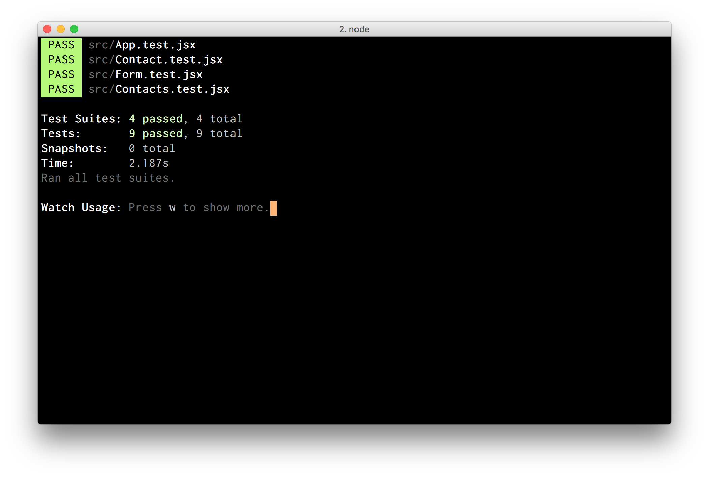

# Contact List

Create-React-App to manage contacts.

## Functionality

- As a user, I can add a new contact to the list.
- As a user, I can see all the contacts on the list in an overview.
- As a user, I can search for a list of users that match a search entry.

## Running the app

Clone this repo:

```
$ git clone https://github.com/groundberry/react-contact-list
```

Install all dependancies:

```
$ npm install
```

Start the server:

```
$ npm start
```

And open the app in your browser at <http://localhost:3000/>.

## Testing the app

Run the tests:

```
$ npm run test
```



## Useful documentation

- [React documentation](https://facebook.github.io/react/docs/thinking-in-react.html)
- [Enzyme](https://github.com/airbnb/enzyme)
